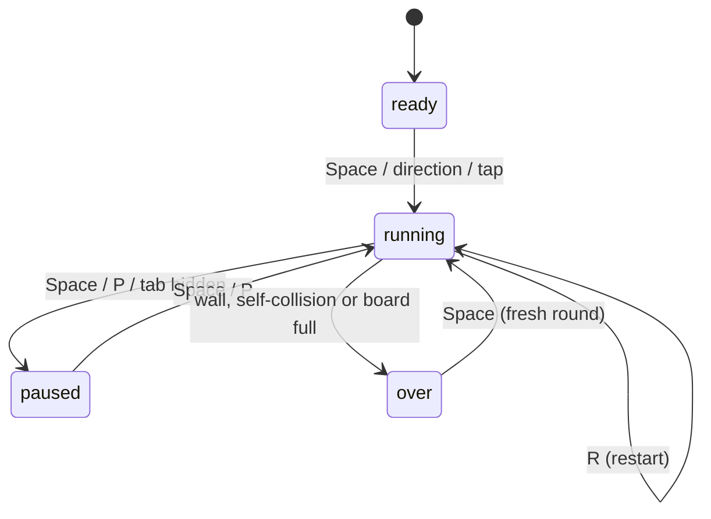

# 🐍 Snake Game

A polished, dependency-free implementation of the classic **Snake** game, built with vanilla **HTML5 Canvas, CSS and JavaScript**. It has a modular architecture, levels that speed up as you play, a persistent high score, mobile touch controls and a unit-tested game engine.

---

## Table of Contents

1. [Features](#features)
2. [Tech Stack](#tech-stack)
3. [Project Structure](#project-structure)
4. [Getting Started](#getting-started)
5. [How to Play](#how-to-play)
6. [Game Rules and Scoring](#game-rules-and-scoring)
7. [Architecture](#architecture)
8. [Configuration](#configuration)
9. [Testing](#testing)
10. [Deploying to GitHub Pages](#deploying-to-github-pages)
11. [Browser Support](#browser-support)
12. [Commit History Guide](#commit-history-guide)
13. [Roadmap](#roadmap)
14. [Contributing](#contributing)
15. [License](#license)

---

## Features

- Classic Snake gameplay on a 20x20 grid rendered with the HTML5 Canvas API
- Progressive difficulty: every 5 foods you reach a new level and the snake speeds up
- Persistent high score saved in `localStorage`
- Keyboard controls (arrow keys and WASD)
- Mobile support: swipe gestures, tap to start/pause and an on-screen D-pad
- Pause / resume, instant restart, and auto-pause when you switch browser tabs
- Direction-safety logic: you cannot reverse into yourself, even with rapid key presses
- Win condition: fill the entire board
- Responsive dark UI that scales to any screen size
- Zero dependencies and no build step
- Unit tests using Node's built-in test runner

---

## Tech Stack

| Layer        | Technology                                 |
| ------------ | ------------------------------------------ |
| Markup       | HTML5                                      |
| Styling      | CSS3 (custom properties, grid, flexbox)    |
| Logic        | Vanilla JavaScript (ES2015+)               |
| Rendering    | HTML5 Canvas 2D API                        |
| Persistence  | Web Storage API (`localStorage`)           |
| Testing      | Node.js built-in test runner (`node:test`) |

---

## Project Structure

```
snake-game/
├── index.html          # Page structure: HUD, canvas, on-screen controls
├── css/
│   └── style.css       # Theme, responsive layout, D-pad styles
├── js/
│   ├── config.js       # All tweakable constants (grid, speed, colors, scoring)
│   ├── snake.js        # Snake class: movement, growth, collisions (pure logic)
│   ├── food.js         # Food spawning on free cells only
│   ├── renderer.js     # Canvas drawing (grid, snake, food, overlays)
│   ├── input.js        # Keyboard, touch swipe and button handling
│   ├── game.js         # Game controller: state machine, loop, score, levels
│   └── main.js         # Entry point that wires everything together
├── tests/
│   ├── snake.test.js   # Unit tests for the Snake class
│   └── food.test.js    # Unit tests for food spawning
├── package.json        # npm script (test)
├── .gitignore
├── LICENSE
└── README.md
```

---

## Getting Started

### Prerequisites

- Any modern web browser
- (Optional) [Node.js](https://nodejs.org/) 18 or newer, only needed to run the tests

### Installation

```bash
git clone https://github.com/<your-username>/snake-game.git
cd snake-game
```

### Run the game

**Option 1: open the file directly.** No server is required.

```bash
# Windows
start index.html
# macOS
open index.html
# Linux
xdg-open index.html
```

**Option 2: VS Code Live Server.** Install the *Live Server* extension, right-click `index.html` and choose **Open with Live Server**.

**Option 3: any static server**, for example with Python:

```bash
python -m http.server 8000
# then visit http://localhost:8000
```

---

## How to Play

### Controls

| Action              | Keyboard              | Touch                   |
| ------------------- | --------------------- | ----------------------- |
| Move up             | `↑` or `W`            | Swipe up / D-pad ▲      |
| Move down           | `↓` or `S`            | Swipe down / D-pad ▼    |
| Move left           | `←` or `A`            | Swipe left / D-pad ◀    |
| Move right          | `→` or `D`            | Swipe right / D-pad ▶   |
| Start / pause       | `Space` or `Enter`    | Tap the board / ⏯ button |
| Pause / resume      | `P`                   | ⏯ button                |
| Restart             | `R`                   | (tap after game over)   |

Pressing a direction key on the title screen also starts the game.

---

## Game Rules and Scoring

- Guide the snake to the red food to eat it. Each food gives **10 points** and makes the snake **one cell longer**.
- The game ends if the snake hits a **wall** or its **own body**.
- Every **5 foods** you advance one level. The delay between moves drops by 10 ms per level, from 150 ms down to a floor of 60 ms.
- Fill the entire board and you win.
- Your **best score** is stored in the browser and survives refreshes.

---

## Architecture

The project follows a strict separation of concerns so each file has a single job:

| Module        | Responsibility                          | Touches the DOM? |
| ------------- | --------------------------------------- | ---------------- |
| `config.js`   | Constants only                          | No               |
| `snake.js`    | Snake data and rules                    | No               |
| `food.js`     | Food placement algorithm                | No               |
| `renderer.js` | Drawing on the canvas                   | Canvas only      |
| `input.js`    | Turning user input into callbacks       | Yes              |
| `game.js`     | State, loop, score, level, persistence  | HUD text only    |
| `main.js`     | Bootstrapping                           | Yes              |

Because `snake.js` and `food.js` are pure logic, they run in Node.js for testing and in the browser without any changes. Each file wraps its code in an IIFE and exports either through `module.exports` (Node) or the `window.SnakeGame` namespace (browser). This avoids ES modules, which browsers block when a page is opened from `file://`.

### Game state machine



### The game loop

The loop uses a self-rescheduling `setTimeout` instead of `setInterval`. After each tick the next delay is recalculated from the current level, so the speed can change smoothly between ticks.

```
tick():
  1. move the snake one cell
  2. wall or self collision?   -> game over
  3. head on food?             -> grow, add score, maybe level up, respawn food
  4. redraw the frame
```

### Design decisions

- **Direction safety:** the reverse-direction check compares against the direction of the *last completed move*, not the last key pressed. This stops the classic bug where pressing Up then Left inside one tick kills a snake that was moving Right.
- **Food spawning:** free cells are collected first and one is picked at random. This guarantees termination and correctness even on a nearly full board.
- **Tail handling:** the tail is removed before collision checks, so moving into the cell the tail just left is legal, as in the original game.

---

## Configuration

All gameplay values live in `js/config.js`:

| Setting            | Default | Description                                   |
| ------------------ | ------- | --------------------------------------------- |
| `GRID_SIZE`        | `20`    | Cells per side of the square board            |
| `CELL_SIZE`        | `24`    | Pixel size of one cell                        |
| `START_LENGTH`     | `3`     | Snake length at the start of a round          |
| `START_SPEED_MS`   | `150`   | Milliseconds between moves at level 1         |
| `MIN_SPEED_MS`     | `60`    | Fastest possible speed                        |
| `SPEED_STEP_MS`    | `10`    | Speed increase per level                      |
| `POINTS_PER_FOOD`  | `10`    | Points awarded per food                       |
| `FOODS_PER_LEVEL`  | `5`     | Foods needed to level up                      |
| `HIGH_SCORE_KEY`   | `snake.highScore` | `localStorage` key for the best score |
| `COLORS`           | -       | Theme colors for the canvas                   |

---

## Testing

The game engine is covered by unit tests using Node's built-in runner, so there is nothing to install.

```bash
npm test
```

The tests cover:

- Initial snake shape and length
- Movement and direction changes
- Reverse-direction protection, including rapid double key presses
- Growth after eating
- Wall collisions and self collisions
- Food never spawning on the snake, always staying inside the grid, and returning `null` on a full board

---

## Deploying to GitHub Pages

Since this is a static site, deployment is free:

1. Push the repository to GitHub.
2. Go to **Settings → Pages**.
3. Under **Build and deployment**, choose **Deploy from a branch**.
4. Select the `main` branch and the `/ (root)` folder, then save.
5. After a minute your game will be live at `https://<your-username>.github.io/snake-game/`.

---

## Browser Support

Works in the current versions of Chrome, Edge, Firefox and Safari, on desktop and mobile. It needs Canvas 2D and ES2015 classes. `localStorage` is optional: if it is blocked, the game still runs and only the high score is not saved.

---

## Commit History Guide

The project was built module by module, one commit per step:

| #  | Commit type | What it added                                     |
| -- | ----------- | ------------------------------------------------- |
| 1  | `chore`     | Repository initialization and `.gitignore`        |
| 2  | `docs`      | Initial README skeleton                           |
| 3  | `feat`      | HTML structure, HUD, canvas and D-pad             |
| 4  | `style`     | Dark theme, responsive layout, mobile controls    |
| 5  | `feat`      | Central configuration module                      |
| 6  | `feat`      | `Snake` class (movement, growth, collisions)      |
| 7  | `feat`      | Safe food spawning                                |
| 8  | `feat`      | Canvas renderer                                   |
| 9  | `feat`      | Keyboard, touch and button input                  |
| 10 | `feat`      | Game controller (state machine, loop, scoring)    |
| 11 | `feat`      | Entry point wiring everything together            |
| 12 | `test`      | Unit tests for snake and food modules             |
| 13 | `chore`     | `package.json` with `test` script                 |
| 14 | `docs`      | This detailed README                              |
| 15 | `chore`     | MIT license                                       |

Commit messages follow the [Conventional Commits](https://www.conventionalcommits.org/) style.

---

## Roadmap

- [ ] Sound effects and a mute toggle
- [ ] Multiple food types (bonus and speed-boost food)
- [ ] Obstacles and additional maps
- [ ] Difficulty presets (easy / normal / hard)
- [ ] Wrap-around walls mode
- [ ] Local leaderboard with player names
- [ ] Smooth interpolated animation between cells

---

## Contributing

Contributions are welcome.

1. Fork the repository
2. Create a feature branch: `git checkout -b feat/my-feature`
3. Make your changes and run `npm test`
4. Commit with a clear message: `git commit -m "feat: describe your change"`
5. Push and open a Pull Request

---

## License

Released under the [MIT License](LICENSE).
